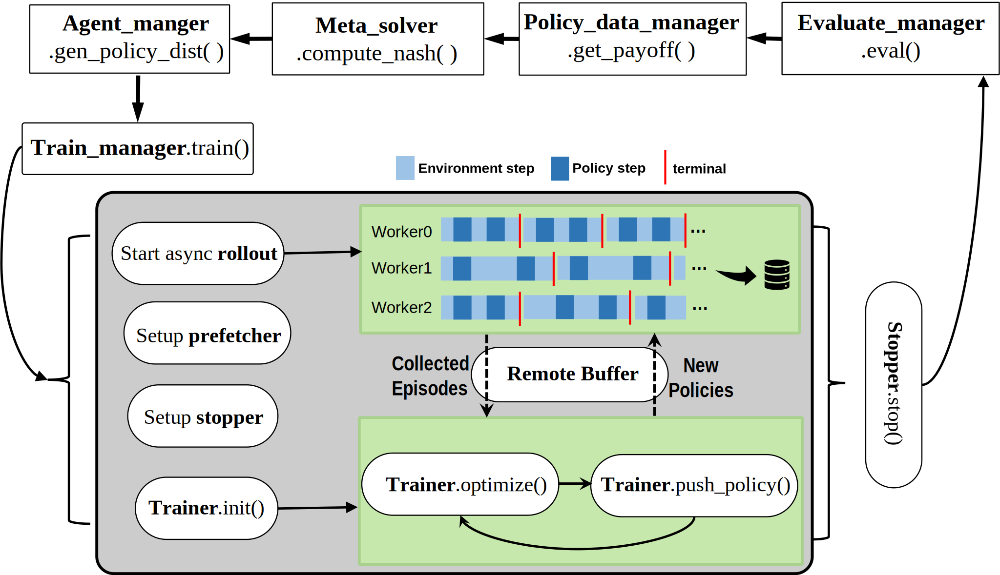
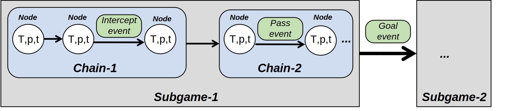
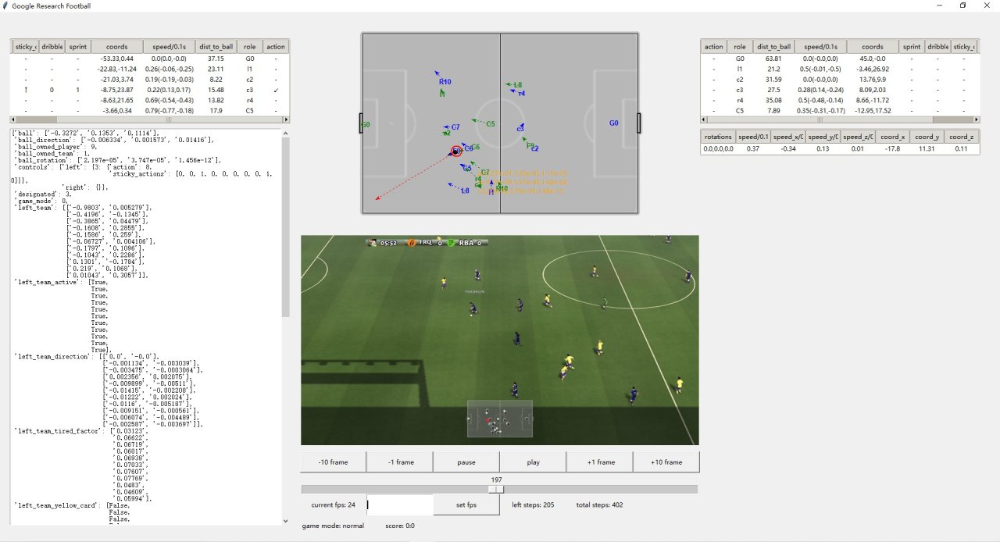
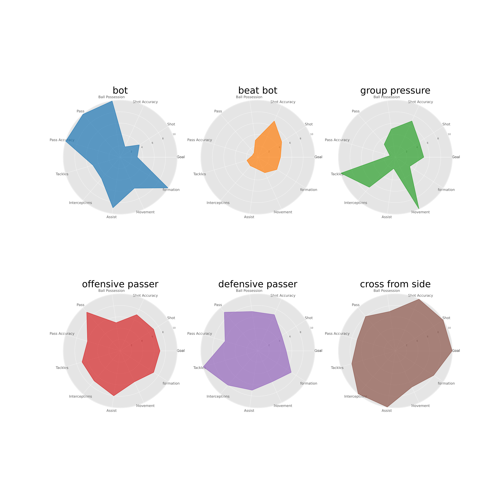

# DB-Football

This repo provides a simple, distributed and asynchronous multi-agent reinforcement learning framework for the [Google Research Football](https://github.com/google-research/football) environment. Currently, it is **dedicated** for **Google Research Football** environment with the cooperative part implemented in **IPPO**/**MAPPO** and the competitive part implemented in **PSRO/Simple League**. In the future, we will also release codes for other related algorithms and environments.

Our codes are based on Light-MALib, which is a simplified version of [MALib](https://github.com/sjtu-marl/malib) with restricted algorithms and environments but certain enhancements, like distributed async-training, league-like multiple population training, detailed tensorboard logging. If you are also interested in other Multi-Agent Learning algorithms and environments, you may also refer to [MALib](https://github.com/sjtu-marl/malib) for more details.

## Contents
1. Install
2. Run Experiments
3. Benchmark 11_vs_11 1.0 hard bot
4. GRF toolkits
5. Benchmark policy
6. Tensorboard tags
7. Documentation
8. Contact
9. Join Us

## Install
You can use any tool to manage your python environment. Here, we use conda as an example.
1. install conda/minconda.
2. `conda create -n light-malib python==3.9` to create a new conda env.
3. activate the env by `conda activate light-malib` when you want to use it or you can add this line to your `.bashrc` file to enable it everytime you login into the bash.

### Install Light-MALib, PyTorch and Google Research Football
1. In the root folder of this repo (with the `setup.py` file), run `pip install -r requirement.txt` to install dependencies of Light-MALib.
2. In the root folder of this repo (with the `setup.py` file), run `pip install .` or `pip install -e .` to install Light-MALib.
3. Follow the instructions in the official website https://pytorch.org/get-started/locally/ to install PyTorch (for example, version 1.13.0+cu116).
4. Follow the instructions in the official repo https://github.com/google-research/football and install the Google Research Football environment.

### Add a New Football Game Scenario
1. You may use `python -c "import gfootball;print(gfootball.__file__)"` or other methods to locate where `gfootball` pacakage is. 
2. Go to the directory of `gfootball` pacakage, for example, `/home/username/miniconda3/envs/light-malib/lib/python3.8/site-packages/gfootball/`.
3. Copy `.py` files under `scenarios` folder in our repo to `scenarios` folder in the `gfootball` pacakage.

## Run Experiments
1. If you want to run experiments on a small cluster, please follow [ray](https://docs.ray.io/en/latest/ray-core/starting-ray.html)'s official instructions to start a cluster. For example, use `ray start --head` on the master, then connect other machines to the master following the hints from command line output.
2. `python light_malib/main_pbt.py --config <config_file_path>` to run a training experiment. An example is given by `train_light_malib.sh`.
3. `python light_malib/scripts/play_gr_football.py` to run a competition between two models. 

## Benchmark 11_vs_11 1.0 hard bot

Beats 1.0 hard bot under multi-agent 11v11 full-game scenraios within 10 hours using IPPO, taking advantage of glitches in built-in logics.

## Google Reseach Football Toolkit
Currently, we provide the following tools for better study in the field of Football AI.
1. [Google Football Game Graph](light_malib/envs/gr_football/game_graph/): A data structure representing a game as a tree structure with branching indicating important events like goals or intercepts.

2. [Google Football Game Debugger](light_malib/envs/gr_football/debugger/): A single-step graphical debugger illustrating both 3D and 2D frames with detailed frame data, such as the movements of players and the ball.

## Benchmark Policy
At this stage, we release some of our trained model for use as initializations or opponents. Model files are available on [Google Drive](https://drive.google.com/drive/folders/1OxdfsYUFRx-0q3VSbIMBoRsbkss_bHnK?usp=sharing) and [Baidu Wangpan](https://pan.baidu.com/s/1nCaz0QZb15_f1XGwVF-Uyw?pwd=nit1).

## Tensorboard tags explained

DataServer:
1. `alive_usage_mean/std`: mean/std usage of data samples in buffer;
2. `mean_wait_time`: total reading waiting time divided reading counts;
3. `sample_per_minute_read`: number of samples read per minute;
4. `sample_per_minute_write`: number of samples written per minute;

PSRO: 
1. `Elo`: Elo-rate during PBT; 
2. `Payoff Table`: plot of payoff table;

Rollout: 
1. `bad_pass,bad_shot,get_intercepted,get_tackled,good_pass,good_shot,interception,num_pass,num_shot,tackle, total_move,total_pass,total_possession,total_shot`: detailed football statistics;
2. `goal_diff`: goal difference of the training agent (positive indicates more goals); 
3. `lose/win`: expected lose/win rate during rollout;
4. `score`: expected scores durig rollout, score for a single game has value 0 if lose, 1 if win and 0.5 if draw;

RolloutTimer
1. `batch`: timer for getting a rollout batch;
2. `env_core_step`: timer for simulator stepping time;
3. `env_step`: total timer for an enviroment step;
4. `feature`: timer for feature encoding;
5. `inference`: timer for policy inference;
6. `policy_update`: timer for pulling policies from remote;
7. `reward`: timer for reward calculation;
8. `rollout`: total timer for one rollout;
9. `sample`: timer for policy sampling;
10. `stats`: timer for collecting statistics;

Training:
1. `Old_V_max/min/mean/std`: value estimate at rollout;
2. `V_max/min/mean/std`: current value estimate;
3. `advantage_max/min/mean/std`: Advantage value;
4. `approx_kl`: KL divergence between old and new action distributions;
5. `clip_ratio`: proportion of clipped entries;
6. `delta_max/min/mean/std`: TD error;
7. `entropy`: entropy value;
8. `imp_weights_max/min/mean/std`: importance weights;
9. `kl_diff`: variation of `approx_kl`;
10. `lower_clip_ratio`: proportion of up-clipping entries;
11. `upper_clip_ratio`: proportion of down-clipping entries;
12. `policy_loss`: policy loss;
14. `training_epoch`: number of training epoch at each iteration;
15. `value_loss`: value loss

TrainingTimer:
1. `compute_return`: timer for GAE compute;
2. `data_copy`: timer for data copy when processing data;
3. `data_generator`: timer for generating data;
4. `loss`: total timer for loss computing;
5. `move_to_gpu`: timer for sending data to GPU;
6. `optimize`: total timer for an optimization step; 
7. `push_policy`: timer for pushing trained policies to the remote;
8. `train_step`: total timer for a training step; 
9. `trainer_data`: timer for get data from `local_queue`;
10. `trainer_optimize`: timer for a optimization step in the trainer;

## Documentation
Under construction, stay tuned :)

## Contact
If you have any questions about this repo, feel free to leave an issue. You can also contact current maintainers, [YanSong97](https://github.com/YanSong97) and [DiligentPanda](https://github.com/DiligentPanda), by email.

## Join Us
Get Interested in our project? Or have great passions in:
1. Multi-Agent Learning and Game AI
2. Operation Research and Optimization
3. Robotics and Control
4. Visual and Graphic Intelligence
5. Data Mining and so on

Welcome! Why not take a look at https://digitalbrain.cn/talents?

With the leading scientists, enginneers and field experts, we are going to provide **Better Decisions for Better World**!

### Digital Brain Laboratory
Digital Brain Laboratory, Shanghai, is co-founded by the founding partner and chairman of CMC Captital, Mr. Ruigang Li, and world-renowned scientist in the field of decision intelligence, Prof. Jun Wang.

### Recruitment

### Recruitment for Students & Internships

